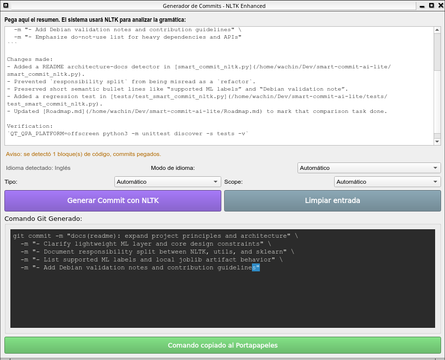

# Smart Commit AI Lite

A lightweight desktop app built with **PyQt6**, **NLTK**, and classic **scikit-learn** that turns pasted change summaries into ready-to-run Conventional Commit commands.

The project is intentionally local-first: no API keys, no cloud model, and no network dependency after the initial NLTK data download and local model setup. It uses a mandatory hybrid architecture: NLTK prepares language-aware text features, scikit-learn classifies the commit type, and `smart_commit_nltk.py` orchestrates the UI, scope detection, subject generation, and body generation.



## Project Principles

- Lightweight, offline-first, open source, Linux friendly, Debian 12 friendly, and low-resource friendly.
- `smart_commit_nltk.py` remains functional and acts as the orchestrator for the hybrid workflow.
- The sklearn engine extends the existing NLTK workflow instead of replacing it.
- Stability, offline compatibility, Debian compatibility, and low memory usage take priority over raw accuracy.
- No transformers, torch, tensorflow, spaCy, Hugging Face tooling, neural networks, cloud APIs, LLM frameworks, online inference, telemetry, or heavy pip-only dependencies.

## Features

- **Bilingual input support**: Detects Spanish or English summaries and keeps the generated subject/body in the same language.
- **Language-aware tokenization**: Uses NLTK Punkt tokenizers for English and Spanish sentence splitting.
- **Spanish action extraction**: Understands common Spanish development phrases such as `he creado`, `actualizado`, `incluye`, `resume`, `corrige`, and `mejora`.
- **Conventional Commits format**: Generates `type(scope): subject` commands with scopes such as `nlp`, `repo`, `docs`, `ui`, `app`, `dict`, and `tools`.
- **Markdown noise filtering**: Ignores pasted fenced code blocks, embedded `git commit -m` examples, Markdown links, and quoted command output that would otherwise pollute the result.
- **Smarter type detection**: Avoids false positives such as classifying a commit as `ci` just because the letters `ci` appear inside Spanish words like `funcionalidades` or `secciones`.
- **Sklearn classifier**: Uses a local TF-IDF + LinearSVC model for `feat`, `fix`, `docs`, `refactor`, `test`, `chore`, and related Conventional Commit type prediction.
- **Distributed model**: Ships with `ml/commit_model.pkl` and `ml/vectorizer.pkl`, with local retraining available when needed.
- **Structured body generation**: Builds up to seven high-signal bullet lines for roadmap work, bilingual NLP changes, UI work, validation, docs, and common project patterns.
- **Clipboard workflow**: Shows a multiline `git commit` command ready to copy and paste into a terminal.

## Installation

### Debian 12 / Ubuntu / Linux Mint

```bash
sudo apt update
sudo apt install \
    python3-pyqt6 \
    python3-nltk \
    python3-sklearn \
    python3-joblib \
    python3-langdetect \
    python3-regex
```

Optional:

```bash
sudo apt install python3-gensim
```

The sklearn packages are part of the standard Debian 12 installation path for this project. The distributed model lives in `ml/commit_model.pkl`, and its TF-IDF vectorizer lives in `ml/vectorizer.pkl`.

This project is designed for Debian repository packages and offline use. Avoid heavy AI stacks such as transformers, torch, tensorflow, spaCy, Hugging Face tooling, cloud APIs, or online inference services.

On first run, the app checks for required NLTK data and downloads missing packages:

- `punkt`
- `averaged_perceptron_tagger`

The Spanish tokenizer is included in the Punkt data package.

Optional pre-download:

```bash
python3 -c "import nltk; nltk.download('punkt'); nltk.download('averaged_perceptron_tagger')"
```

## Usage

1. Run the app:

   ```bash
   python3 smart_commit_nltk.py
   ```

2. Paste a summary from your own notes, an assistant response, or a changelog-style paragraph.
3. Leave the language mode on automatic, or choose Spanish / English manually if the text is mixed.
4. Click the NLTK commit generation button.
5. Review the generated command, detected language status, and any non-blocking noise warning.
6. Adjust **Tipo** or **Scope** if the automatic choice needs a manual correction.
7. Copy it to the clipboard and run it in your repository. The copy button confirms the action in-place, without opening a popup.

## Hybrid Architecture

The machine-learning engine predicts the Conventional Commit type. Supported ML labels include:

- `feat`
- `fix`
- `docs`
- `refactor`
- `test`
- `chore`

Responsibility split:

- **NLTK/utils**: normalization, cleanup, tokenization, stemming, stopword removal, language detection, and language-aware preprocessing.
- **scikit-learn**: TF-IDF vectorization and ML classification of commit types.
- **`smart_commit_nltk.py` orchestrator**: coordinates the flow: NLTK preprocessing -> sklearn classification -> NLTK/heuristic subject and body generation. It also handles scope detection and the UI workflow.

## Model Training

Train or retrain the local model after installing `python3-sklearn`:

```bash
python3 -m ml.train_model
```

The trainer reads local examples from:

- `commit_examples_data/examples.json`
- `commit_examples_data/examples.db`
- `commit_examples_data/entries/`

It writes:

- `ml/commit_model.pkl`
- `ml/vectorizer.pkl`

The project distributes a pre-trained model for these default filenames. Users can retrain locally and replace them as needed.

The model is trained and loaded locally with `joblib`. It does not use network access, online inference, or external services.

The UI shows the local model status at startup. If the distributed artifacts are not present yet, it points users to `python3 -m ml.train_model`.

## Testing and Evaluation

Run the regression tests:

```bash
QT_QPA_PLATFORM=offscreen python3 -m unittest discover -s tests -v
```

Recalculate the example-dataset comparison report:

```bash
QT_QPA_PLATFORM=offscreen python3 commit_examples_data/compare_generator.py
```

The comparison report is written to `commit_examples_data/comparison_report.json`. The current heuristics intentionally cap generated bodies at seven bullets, so body-count metrics are not expected to match older examples that contain longer commit bodies.

## Examples

English input about bilingual NLP improvements can produce:

```bash
git commit -m "feat(nlp): add bilingual support and fix type detection" \
  -m "- Detect input language for localized tokenization" \
  -m "- Support Spanish verbs like creado, actualizado, and incluye" \
  -m "- Generate commit subject and body in the source language" \
  -m "- Fix false-positive ci detection inside common words" \
  -m "- Validate syntax with py_compile"
```

Input about roadmap work can produce:

```bash
git commit -m "docs(repo): add roadmap with progress tracking" \
  -m "- Document completed features and project progress" \
  -m "- Outline future work for Git, ML, UI, tests, and multilingual support" \
  -m "- Organize the roadmap with clear status sections" \
  -m "- Include documentation, community, and testing areas" \
  -m "- Use checkbox format for completed and pending tasks"
```

Short change summaries map to Conventional Commit types:

```text
fixed crash when opening audio files -> fix
added MIDI karaoke support -> feat
updated installation instructions -> docs
cleaned deprecated code -> refactor
```

## How It Works

1. **Noise cleanup**: Removes Markdown fences, embedded commit commands, copied `-m` lines, Markdown link targets, and other assistant/terminal noise.
2. **Language detection**: Scores Spanish and English markers to choose `es` or `en`.
3. **Sentence splitting**: Uses NLTK sentence tokenization with the detected language.
4. **Action extraction**: Applies English POS tagging and rule-based Spanish patterns to find the main action and object.
5. **Type/scope selection**: Classifies the change into Conventional Commit type/scope using whole-word matching and project-aware keywords.
6. **ML prediction**: The local TF-IDF + LinearSVC classifier predicts the commit type.
7. **Body generation**: Adds concise, localized bullets for detected change categories.
8. **Formatting**: Keeps the subject short and emits a shell-ready multiline `git commit` command.

## Project Structure

```text
├── smart_commit_nltk.py          # Main PyQt6 application
├── Roadmap.md                    # Current progress and planned improvements
├── COMMIT_GENERATION_EXAMPLES.md # Real-world examples and expected outputs
├── commit_examples_data/         # Parsed JSON/SQLite examples and comparison tools
├── ml/                           # Sklearn training, model, vectorizer, and prediction modules
├── utils/                        # Shared preprocessing, language, and regex helpers
├── tests/                        # Regression tests for NLP heuristics
└── README.md                     # Project documentation
```

## Current Limitations

- Spanish grammar support is rule-based. NLTK Punkt can split Spanish sentences, but this project does not currently use a full Spanish POS tagger.
- The generator is hybrid NLTK + classic ML, not a large language model. It improves through specific patterns, examples, and evaluation data.
- The current dataset is small and mostly feature-oriented, so the ML classifier uses a small offline seed set to represent all six supported types.
- Real sklearn training and prediction should still be validated on a Debian 12 system with the required apt packages installed.
- It works best with summaries that describe concrete changes, files, features, validation, and user-visible behavior.

## Contributing

Good contributions include:

- Adding more Spanish and English phrase patterns.
- Expanding `commit_examples_data` with real summaries and expected commits.
- Adding balanced examples for `fix`, `docs`, `refactor`, `test`, and `chore`.
- Improving comparison metrics.
- Adding tests for language detection, Markdown cleanup, type/scope selection, ML prediction, and body generation.

## License

This project is open-source and available under GPL 3.
